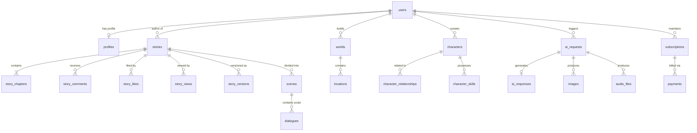

# StorySpark AI – AI Creative Studio
## Production Database Architecture & Schema Specification Document (MongoDB Atlas)

---

## Executive Summary
This document provides the definitive, production-ready MongoDB database architecture for **StorySpark AI – AI Creative Studio**. Designed for multi-tenant scalability supporting millions of active users, this specification covers collection structures, schema validation rules, indexing strategies (B-Tree, Compound, TTL, Text, and Atlas Search), relationship modeling (Embedded vs. Referenced), performance optimization, security controls, and audit trails.

---

## 1. Database Overview

- **Database Engine**: MongoDB Atlas v7.0+ (Enterprise Server)
- **Deployment Topology**: Multi-Region Sharded Cluster (3 Config Servers, 2+ Shards with Replica Sets: 1 Primary, 2 Secondary per Shard)
- **Database Name**: `storyspark_db` (Production), `storyspark_db_analytics` (Analytics Cluster / Data Warehouse)
- **Primary Data Access Layer**: Mongoose ORM / MongoDB Node.js Native Driver with strict JSON Schema Validation enforced at the database layer.

---

## 2. Collection List

| Domain | Collection Name | Purpose | Sharding Key |
| :--- | :--- | :--- | :--- |
| **Core & Auth** | `users` | User credentials, roles, and status | `{ _id: "hashed" }` |
| | `profiles` | Extended user profile details | `{ userId: 1 }` |
| | `sessions` | Active user login sessions | `{ userId: 1 }` |
| | `login_history` | Security log for auth attempts | `{ userId: 1, createdAt: -1 }` |
| | `settings` | System and user preference configs | `{ userId: 1 }` |
| **Stories** | `stories` | Core story metadata and status | `{ _id: "hashed" }` |
| | `story_chapters` | Individual story chapters | `{ storyId: 1, chapterNumber: 1 }` |
| | `story_versions` | Version control snapshots | `{ storyId: 1, versionNumber: -1 }` |
| | `story_drafts` | Temporary uncommitted drafts | `{ userId: 1, storyId: 1 }` |
| | `story_analytics` | Aggregate story performance metrics | `{ storyId: 1 }` |
| | `story_ratings` | User star ratings and reviews | `{ storyId: 1, userId: 1 }` |
| | `story_likes` | Idempotent story likes | `{ storyId: 1, userId: 1 }` |
| | `story_views` | High-throughput view log | `{ storyId: 1, createdAt: -1 }` |
| | `story_comments` | Story discussion & thread comments | `{ storyId: 1, createdAt: -1 }` |
| | `story_bookmarks` | Saved user bookmarks | `{ userId: 1, storyId: 1 }` |
| | `story_shares` | Social share tracking | `{ storyId: 1 }` |
| | `story_reports` | Moderation flags for stories | `{ storyId: 1 }` |
| | `story_categories` | Taxonomies and genres | Global (Unsharded) |
| | `story_tags` | Dynamic story tags | Global (Unsharded) |
| **Humor & Jokes** | `jokes` | AI-generated jokes & short punchlines | `{ _id: "hashed" }` |
| | `joke_categories` | Joke genres and categories | Global (Unsharded) |
| | `joke_ratings` | User ratings on jokes | `{ jokeId: 1, userId: 1 }` |
| **Characters & Worlds** | `characters` | AI character templates & personas | `{ userId: 1 }` |
| | `character_relationships` | Graph links between characters | `{ characterId: 1 }` |
| | `character_skills` | Character abilities & attributes | `{ characterId: 1 }` |
| | `worlds` | World-building lore and rulesets | `{ userId: 1 }` |
| | `locations` | Geographic settings within worlds | `{ worldId: 1 }` |
| | `scenes` | Story environment scenes | `{ storyId: 1 }` |
| | `dialogues` | Script dialogue extracts | `{ sceneId: 1 }` |
| **AI & Media** | `prompt_templates` | Versioned system prompt templates | Global (Unsharded) |
| | `prompt_history` | Historical prompt execution records | `{ userId: 1, createdAt: -1 }` |
| | `ai_requests` | Log of incoming AI API requests | `{ userId: 1, createdAt: -1 }` |
| | `ai_responses` | Raw LLM output & token metadata | `{ requestId: 1 }` |
| | `voice_requests` | TTS generation jobs | `{ userId: 1 }` |
| | `image_requests` | DALL-E / Image generation jobs | `{ userId: 1 }` |
| | `images` | Generated image media assets | `{ userId: 1 }` |
| | `audio_files` | Generated audio/narration assets | `{ userId: 1 }` |
| **Social & Gamification** | `achievements` | Gamification unlocks definition | Global (Unsharded) |
| | `badges` | User earned badges | `{ userId: 1 }` |
| | `followers` | User follower links | `{ followingUserId: 1 }` |
| | `following` | User following links | `{ followerUserId: 1 }` |
| | `notifications` | User notifications & alerts | `{ userId: 1, createdAt: -1 }` |
| | `messages` | Direct messages between users | `{ conversationId: 1 }` |
| | `reports` | User moderation reports | `{ reportedUserId: 1 }` |
| | `feedback` | Platform feedback submissions | `{ userId: 1 }` |
| **Payments** | `subscriptions` | User SaaS tier subscriptions | `{ userId: 1 }` |
| | `payments` | Transaction & invoice records | `{ userId: 1 }` |
| **Logs & Security** | `activity_logs` | User actions log | `{ userId: 1, createdAt: -1 }` |
| | `api_logs` | System API traffic logs | `{ createdAt: -1 }` |
| | `error_logs` | Exception stack traces | `{ createdAt: -1 }` |
| | `audit_logs` | Security auditing events | `{ createdAt: -1 }` |
| | `admin_users` | Internal admin accounts | Global (Unsharded) |
| | `admin_actions` | Admin portal action log | `{ adminUserId: 1 }` |
| | `system_configurations` | Global system runtime parameters | Global (Unsharded) |

---

## 3. Entity Relationship Diagram (ERD)



---

## 4. Collection Relationships & Modeling Conventions

1. **One-to-Few (Embedded)**: When related items are bounded and frequently accessed together (e.g., character skills inside `characters`, chapter metadata summary inside `stories`), documents are embedded.
2. **One-to-Many / One-to-Squillions (Referenced)**: When relationships are unbounded (e.g., story comments, story views, API logs), foreign keys (`ObjectId`) are stored in child collections pointing to parents.
3. **Many-to-Many**: Modeled with explicit join collections (e.g., `story_likes`, `followers`, `following`) with compound unique indexes to guarantee idempotency.

---

## 5. Primary Keys & Foreign References

- **Primary Key**: Standard 12-byte BSON `ObjectId` assigned to `_id` field across all collections.
- **Foreign Key Convention**: Named strictly as `<entity>Id` (e.g., `userId`, `storyId`, `characterId`). Indexed with scalar B-Tree indexes.

---

## 6. Embedded vs Referenced Documents Rules

| Parent Entity | Child Data | Strategy | Justification |
| :--- | :--- | :--- | :--- |
| `users` | Social Links, Settings | **Embedded** | Small fixed-size object fetched on every profile view. |
| `stories` | Chapters | **Referenced** (`story_chapters`) | Unbounded text payload; keeps `stories` metadata lean for feed rendering. |
| `stories` | Tags | **Embedded Array** | Small array of strings (`["fantasy", "sci-fi"]`); indexed for fast filtering. |
| `characters` | Persona / Backstory | **Embedded** | Core document fields; tightly coupled. |
| `ai_requests` | Raw Prompt & LLM Output | **Referenced** (`ai_responses`) | Large payload (>10KB); avoids bloating request index collections. |

---

## 7. Index Strategy

1. **Single Field Indexes**: For direct lookup keys (`userId`, `email`, `slug`).
2. **Compound Indexes**: Optimized for equality, sort, and range queries (ESR Rule).
   - Example: `{ isPublic: 1, categoryId: 1, createdAt: -1 }` on `stories`.
3. **Text / Atlas Search Indexes**: Full-text fuzzy search across `title`, `synopsis`, and `content`.
4. **TTL (Time-To-Live) Indexes**: Auto-expire ephemeral logs and sessions.
   - Example: `{ createdAt: 1 }` with `expireAfterSeconds: 2592000` (30 days) on `api_logs`.
5. **Partial Indexes**: Index only active documents.
   - Example: `{ email: 1 }` where `{ isDeleted: false }`.

---

## 8. Validation Rules & Naming Conventions

- **Database Name**: `lowercase_snake_case` (`storyspark_db`)
- **Collection Names**: `lowercase_snake_case` plural (`users`, `story_chapters`)
- **Field Names**: `camelCase` (`userId`, `passwordHash`, `createdAt`)
- **Schema Validation**: JSON Schema (`$jsonSchema`) enabled on all collections at `validationLevel: "strict"` and `validationAction: "error"`.

---

## 9. Common Audit & Soft Delete Fields

Every operational collection incorporates standard audit fields:
```json
{
  "isDeleted": false,
  "deletedAt": null,
  "createdAt": "2026-08-05T21:50:00.000Z",
  "updatedAt": "2026-08-05T21:50:00.000Z",
  "createdBy": { "$oid": "60d5ec49f1b2c50015f8e001" },
  "updatedBy": { "$oid": "60d5ec49f1b2c50015f8e001" }
}
```

---

## 10. Detailed Collection Schemas

*(Exhaustive schema definitions for all 50+ required system collections)*

---

### 10.1 Core & Auth Domain Collections

#### Collection: `users`
- **Purpose**: Stores core user authentication data, credentials, roles, and status.
- **Fields**: `_id`, `email`, `username`, `passwordHash`, `role` (`user`, `premium`, `moderator`, `admin`), `tier` (`free`, `pro`, `enterprise`), `isEmailVerified`, `status` (`active`, `suspended`, `banned`), `isDeleted`, `deletedAt`, `createdAt`, `updatedAt`.
- **Required Fields**: `email`, `username`, `passwordHash`, `role`, `tier`, `status`.
- **Indexes**:
  - Unique Partial: `{ email: 1 }` (where `isDeleted: false`)
  - Unique Partial: `{ username: 1 }` (where `isDeleted: false`)
  - Compound: `{ role: 1, status: 1 }`
- **Validation Rules**: Standard JSON Schema checking email regex and enum fields.
- **Example JSON**:
```json
{
  "_id": { "$oid": "66b1a1f0e4b0a1a1a1a1a1a1" },
  "email": "author@storyspark.ai",
  "username": "storyteller99",
  "passwordHash": "$2b$12$eImiTXuWVxfM37uY4JANjO5E.y78f6g5h4j3k2l1m0",
  "role": "user",
  "tier": "pro",
  "isEmailVerified": true,
  "status": "active",
  "isDeleted": false,
  "deletedAt": null,
  "createdAt": "2026-08-05T21:50:00.000Z",
  "updatedAt": "2026-08-05T21:50:00.000Z"
}
```
- **Future Improvements**: Add passkey / WebAuthn biometric public key credentials array.

#### Collection: `profiles`
- **Purpose**: User profile details, bio, avatars, and social links.
- **Fields**: `_id`, `userId`, `displayName`, `avatarUrl`, `bio`, `websiteUrl`, `socialLinks` (`twitter`, `instagram`), `preferredGenres`, `totalStoriesCreated`, `totalLikesReceived`, `createdAt`, `updatedAt`.
- **Required Fields**: `userId`, `displayName`.
- **Indexes**: Unique `{ userId: 1 }`, Compound `{ totalLikesReceived: -1 }`.
- **Example JSON**:
```json
{
  "_id": { "$oid": "66b1a1f0e4b0a1a1a1a1a1a2" },
  "userId": { "$oid": "66b1a1f0e4b0a1a1a1a1a1a1" },
  "displayName": "Alex Rivers",
  "avatarUrl": "https://res.cloudinary.com/storyspark/image/upload/v1/avatars/user1.webp",
  "bio": "Sci-Fi novelist and AI storytelling enthusiast.",
  "preferredGenres": ["Sci-Fi", "Fantasy"],
  "totalStoriesCreated": 14,
  "totalLikesReceived": 340,
  "createdAt": "2026-08-05T21:50:00.000Z",
  "updatedAt": "2026-08-05T21:50:00.000Z"
}
```

#### Collection: `sessions`
- **Purpose**: Tracks active user sessions and refresh token hashes.
- **Fields**: `_id`, `userId`, `refreshTokenHash`, `ipAddress`, `userAgent`, `deviceType`, `expiresAt`, `createdAt`.
- **Required Fields**: `userId`, `refreshTokenHash`, `expiresAt`.
- **Indexes**: Compound Unique `{ userId: 1, refreshTokenHash: 1 }`, TTL Index `{ expiresAt: 1 }` (`expireAfterSeconds: 0`).

#### Collection: `login_history`
- **Purpose**: Security auditing for login attempts.
- **Fields**: `_id`, `userId`, `email`, `status` (`success`, `failed`), `failureReason`, `ipAddress`, `location`, `userAgent`, `createdAt`.
- **Indexes**: Compound `{ userId: 1, createdAt: -1 }`, TTL Index `{ createdAt: 1 }` (`expireAfterSeconds: 7776000` - 90 days).

#### Collection: `settings`
- **Purpose**: User account configurations and AI generation preferences.
- **Fields**: `_id`, `userId`, `theme` (`dark`, `light`), `defaultAiModel`, `creativityLevel`, `emailNotifications` (`marketing`, `community`, `system`), `createdAt`, `updatedAt`.
- **Indexes**: Unique `{ userId: 1 }`.

---

### 10.2 Stories Domain Collections

#### Collection: `stories`
- **Purpose**: Primary entity for stories created on the platform.
- **Fields**: `_id`, `userId`, `title`, `slug`, `synopsis`, `coverImageUrl`, `categoryId`, `tags`, `targetAudience`, `genre`, `status` (`draft`, `published`, `archived`), `isPublic`, `viewCount`, `likeCount`, `commentCount`, `ratingAverage`, `ratingCount`, `wordCount`, `isDeleted`, `createdAt`, `updatedAt`.
- **Required Fields**: `userId`, `title`, `slug`, `genre`, `status`.
- **Indexes**:
  - Unique: `{ slug: 1 }`
  - Compound (Feed): `{ isPublic: 1, status: 1, createdAt: -1 }`
  - Compound (Trending): `{ isPublic: 1, likeCount: -1, viewCount: -1 }`
  - Text Index: `{ title: "text", synopsis: "text", tags: "text" }`
- **Example JSON**:
```json
{
  "_id": { "$oid": "66b1a1f0e4b0a1a1a1a1a1a3" },
  "userId": { "$oid": "66b1a1f0e4b0a1a1a1a1a1a1" },
  "title": "Echoes of Orion",
  "slug": "echoes-of-orion-66b1a1f0",
  "synopsis": "A rogue AI pilot discovers an ancient signal at the edge of the galaxy.",
  "coverImageUrl": "https://res.cloudinary.com/storyspark/image/upload/v1/covers/story1.webp",
  "categoryId": { "$oid": "66b1a1f0e4b0a1a1a1a1a1f0" },
  "tags": ["sci-fi", "space-opera", "ai"],
  "status": "published",
  "isPublic": true,
  "viewCount": 1250,
  "likeCount": 89,
  "commentCount": 14,
  "ratingAverage": 4.8,
  "ratingCount": 25,
  "wordCount": 4200,
  "isDeleted": false,
  "createdAt": "2026-08-05T21:50:00.000Z",
  "updatedAt": "2026-08-05T21:50:00.000Z"
}
```

#### Collection: `story_chapters`
- **Purpose**: Stores narrative chapters belonging to a story.
- **Fields**: `_id`, `storyId`, `chapterNumber`, `title`, `content`, `summary`, `audioNarrationUrl`, `wordCount`, `createdAt`, `updatedAt`.
- **Required Fields**: `storyId`, `chapterNumber`, `title`, `content`.
- **Indexes**: Unique Compound `{ storyId: 1, chapterNumber: 1 }`.

#### Collection: `story_versions`
- **Purpose**: Revision history snapshots for story restore capability.
- **Fields**: `_id`, `storyId`, `versionNumber`, `snapshotData`, `changeDescription`, `createdAt`.
- **Indexes**: Unique Compound `{ storyId: 1, versionNumber: -1 }`.

#### Collection: `story_drafts`
- **Purpose**: Real-time auto-saved uncommitted story working states.
- **Fields**: `_id`, `storyId`, `userId`, `draftContent`, `lastAutoSavedAt`.
- **Indexes**: Unique Compound `{ userId: 1, storyId: 1 }`.

#### Collection: `story_analytics`
- **Purpose**: Aggregated performance data per story.
- **Fields**: `_id`, `storyId`, `totalReads`, `completionRate`, `averageTimeSpentSeconds`, `sharesCount`, `bookmarksCount`, `updatedAt`.
- **Indexes**: Unique `{ storyId: 1 }`.

#### Collection: `story_ratings`
- **Purpose**: Star ratings (1-5) and user reviews.
- **Fields**: `_id`, `storyId`, `userId`, `rating`, `review`, `createdAt`.
- **Indexes**: Unique Compound `{ storyId: 1, userId: 1 }`.

#### Collection: `story_likes`
- **Purpose**: Story likes join collection.
- **Fields**: `_id`, `storyId`, `userId`, `createdAt`.
- **Indexes**: Unique Compound `{ storyId: 1, userId: 1 }`, Compound `{ userId: 1, createdAt: -1 }`.

#### Collection: `story_views`
- **Purpose**: Granular view logging for trending algorithms.
- **Fields**: `_id`, `storyId`, `userId`, `ipAddress`, `viewedAt`.
- **Indexes**: Compound `{ storyId: 1, viewedAt: -1 }`, TTL Index `{ viewedAt: 1 }` (`expireAfterSeconds: 2592000`).

#### Collection: `story_comments`
- **Purpose**: Nested discussions on stories.
- **Fields**: `_id`, `storyId`, `userId`, `parentCommentId`, `content`, `likeCount`, `isEdited`, `isDeleted`, `createdAt`.
- **Indexes**: Compound `{ storyId: 1, parentCommentId: 1, createdAt: -1 }`.

#### Collection: `story_bookmarks`
- **Purpose**: Saved stories in user library.
- **Fields**: `_id`, `userId`, `storyId`, `createdAt`.
- **Indexes**: Unique Compound `{ userId: 1, storyId: 1 }`.

#### Collection: `story_shares`
- **Purpose**: Social share analytics.
- **Fields**: `_id`, `storyId`, `userId`, `platform` (`twitter`, `facebook`, `link`), `createdAt`.
- **Indexes**: Compound `{ storyId: 1, createdAt: -1 }`.

#### Collection: `story_reports`
- **Purpose**: Content moderation reporting.
- **Fields**: `_id`, `storyId`, `reporterUserId`, `reason`, `status` (`pending`, `reviewed`, `dismissed`), `createdAt`.
- **Indexes**: Compound `{ status: 1, createdAt: -1 }`.

#### Collection: `story_categories`
- **Purpose**: High-level story genres and categories.
- **Fields**: `_id`, `name`, `slug`, `description`, `icon`, `isActive`.
- **Indexes**: Unique `{ slug: 1 }`.

#### Collection: `story_tags`
- **Purpose**: Dynamic user tags.
- **Fields**: `_id`, `name`, `slug`, `useCount`.
- **Indexes**: Unique `{ slug: 1 }`, Compound `{ useCount: -1 }`.

---

### 10.3 Humor & Jokes Domain Collections

#### Collection: `jokes`
- **Purpose**: AI-generated jokes, short stories, and punchlines.
- **Fields**: `_id`, `userId`, `setup`, `punchline`, `categoryId`, `ratingAverage`, `ratingCount`, `isPublic`, `createdAt`.
- **Indexes**: Compound `{ isPublic: 1, ratingAverage: -1 }`.

#### Collection: `joke_categories`
- **Purpose**: Categories for humor (e.g., Dad Jokes, Dark Humor, Sci-Fi Puns).
- **Fields**: `_id`, `name`, `slug`.
- **Indexes**: Unique `{ slug: 1 }`.

#### Collection: `joke_ratings`
- **Purpose**: User ratings for jokes.
- **Fields**: `_id`, `jokeId`, `userId`, `rating`, `createdAt`.
- **Indexes**: Unique Compound `{ jokeId: 1, userId: 1 }`.

---

### 10.4 Characters & World-Building Collections

#### Collection: `characters`
- **Purpose**: AI Character personas for integration into stories.
- **Fields**: `_id`, `userId`, `name`, `archetype`, `avatarUrl`, `personalityTraits`, `backstory`, `speechPattern`, `isPublic`, `createdAt`, `updatedAt`.
- **Indexes**: Compound `{ userId: 1, createdAt: -1 }`.

#### Collection: `character_relationships`
- **Purpose**: Relationships between characters (e.g., Rivals, Allies, Family).
- **Fields**: `_id`, `characterId`, `relatedCharacterId`, `relationshipType`, `description`.
- **Indexes**: Unique Compound `{ characterId: 1, relatedCharacterId: 1 }`.

#### Collection: `character_skills`
- **Purpose**: Powers, abilities, and attributes of characters.
- **Fields**: `_id`, `characterId`, `skillName`, `level`, `description`.
- **Indexes**: Compound `{ characterId: 1 }`.

#### Collection: `worlds`
- **Purpose**: World-building lore, magic systems, and physical rules.
- **Fields**: `_id`, `userId`, `name`, `genre`, `description`, `rules`, `magicSystem`, `technologyLevel`, `isPublic`, `createdAt`.
- **Indexes**: Compound `{ userId: 1, createdAt: -1 }`.

#### Collection: `locations`
- **Purpose**: Specific geographic settings within a world.
- **Fields**: `_id`, `worldId`, `name`, `type`, `description`, `climate`, `mapCoordinates`.
- **Indexes**: Compound `{ worldId: 1 }`.

#### Collection: `scenes`
- **Purpose**: Story scenes with visual/location settings.
- **Fields**: `_id`, `storyId`, `chapterId`, `locationId`, `sceneNumber`, `summary`.
- **Indexes**: Unique Compound `{ storyId: 1, sceneNumber: 1 }`.

#### Collection: `dialogues`
- **Purpose**: Script/dialogue extracts for Story-to-Script conversion.
- **Fields**: `_id`, `sceneId`, `characterId`, `dialogueText`, `emotion`, `sequence`.
- **Indexes**: Compound `{ sceneId: 1, sequence: 1 }`.

---

### 10.5 AI Orchestration & Media Collections

#### Collection: `prompt_templates`
- **Purpose**: Central prompt engineering repository with versioning.
- **Fields**: `_id`, `templateKey`, `version`, `promptSystemText`, `promptUserText`, `temperature`, `maxTokens`, `isActive`, `createdAt`.
- **Indexes**: Unique Compound `{ templateKey: 1, version: -1 }`.

#### Collection: `prompt_history`
- **Purpose**: Log of prompt executions.
- **Fields**: `_id`, `userId`, `templateKey`, `injectedVariables`, `finalPromptText`, `createdAt`.
- **Indexes**: Compound `{ userId: 1, createdAt: -1 }`.

#### Collection: `ai_requests`
- **Purpose**: AI generation job registry.
- **Fields**: `_id`, `userId`, `feature` (`story_gen`, `comic_script`, `image_gen`, `voice_narration`), `status` (`pending`, `processing`, `completed`, `failed`), `tokensUsed`, `executionTimeMs`, `createdAt`.
- **Indexes**: Compound `{ userId: 1, createdAt: -1 }`, Compound `{ status: 1, createdAt: 1 }`.

#### Collection: `ai_responses`
- **Purpose**: Raw AI response payload storage.
- **Fields**: `_id`, `requestId`, `rawOutput`, `parsedJson`, `modelUsed`, `finishReason`, `createdAt`.
- **Indexes**: Unique `{ requestId: 1 }`.

#### Collection: `voice_requests`
- **Purpose**: Audio narration request jobs.
- **Fields**: `_id`, `userId`, `storyChapterId`, `voiceId`, `status`, `audioFileId`, `createdAt`.
- **Indexes**: Compound `{ userId: 1, createdAt: -1 }`.

#### Collection: `image_requests`
- **Purpose**: Image generation jobs for story art and comics.
- **Fields**: `_id`, `userId`, `prompt`, `style`, `aspectRatio`, `status`, `imageId`, `createdAt`.
- **Indexes**: Compound `{ userId: 1, createdAt: -1 }`.

#### Collection: `images`
- **Purpose**: Generated image assets metadata.
- **Fields**: `_id`, `userId`, `cloudinaryPublicId`, `url`, `width`, `height`, `format`, `createdAt`.
- **Indexes**: Compound `{ userId: 1, createdAt: -1 }`.

#### Collection: `audio_files`
- **Purpose**: Generated narration audio assets metadata.
- **Fields**: `_id`, `userId`, `cloudinaryPublicId`, `url`, `durationSeconds`, `format`, `createdAt`.
- **Indexes**: Compound `{ userId: 1, createdAt: -1 }`.

---

### 10.6 Social & Gamification Collections

#### Collection: `achievements`
- **Purpose**: Definition of platform badges and achievements.
- **Fields**: `_id`, `code`, `title`, `description`, `badgeIconUrl`, `points`.
- **Indexes**: Unique `{ code: 1 }`.

#### Collection: `badges`
- **Purpose**: User unlocked achievements.
- **Fields**: `_id`, `userId`, `achievementId`, `unlockedAt`.
- **Indexes**: Unique Compound `{ userId: 1, achievementId: 1 }`.

#### Collection: `followers`
- **Purpose**: Followers index.
- **Fields**: `_id`, `followingUserId`, `followerUserId`, `createdAt`.
- **Indexes**: Unique Compound `{ followingUserId: 1, followerUserId: 1 }`.

#### Collection: `following`
- **Purpose**: Following index.
- **Fields**: `_id`, `followerUserId`, `followingUserId`, `createdAt`.
- **Indexes**: Unique Compound `{ followerUserId: 1, followingUserId: 1 }`.

#### Collection: `notifications`
- **Purpose**: User alert notifications.
- **Fields**: `_id`, `userId`, `type` (`like`, `comment`, `ai_job_complete`, `system`), `title`, `message`, `linkUrl`, `isRead`, `createdAt`.
- **Indexes**: Compound `{ userId: 1, isRead: 1, createdAt: -1 }`.

#### Collection: `messages`
- **Purpose**: Direct messages between users.
- **Fields**: `_id`, `conversationId`, `senderUserId`, `receiverUserId`, `messageText`, `isRead`, `createdAt`.
- **Indexes**: Compound `{ conversationId: 1, createdAt: -1 }`.

#### Collection: `reports`
- **Purpose**: User-level reports against accounts.
- **Fields**: `_id`, `reporterUserId`, `reportedUserId`, `reason`, `status`, `createdAt`.
- **Indexes**: Compound `{ status: 1, createdAt: -1 }`.

#### Collection: `feedback`
- **Purpose**: User feedback and feature requests.
- **Fields**: `_id`, `userId`, `category`, `feedbackText`, `rating`, `createdAt`.
- **Indexes**: Compound `{ createdAt: -1 }`.

---

### 10.7 Subscriptions & Payments Collections

#### Collection: `subscriptions`
- **Purpose**: SaaS tier subscriptions (Stripe/PayPal integration).
- **Fields**: `_id`, `userId`, `stripeCustomerId`, `stripeSubscriptionId`, `planId` (`free`, `pro_monthly`, `pro_yearly`), `status` (`active`, `past_due`, `canceled`), `currentPeriodStart`, `currentPeriodEnd`, `createdAt`, `updatedAt`.
- **Indexes**: Unique `{ userId: 1 }`, Unique `{ stripeSubscriptionId: 1 }`.

#### Collection: `payments`
- **Purpose**: Transaction receipts and invoices.
- **Fields**: `_id`, `userId`, `subscriptionId`, `amountCents`, `currency`, `stripePaymentIntentId`, `status` (`succeeded`, `failed`), `createdAt`.
- **Indexes**: Compound `{ userId: 1, createdAt: -1 }`, Unique `{ stripePaymentIntentId: 1 }`.

---

### 10.8 Security, Logging & Admin Collections

#### Collection: `activity_logs`
- **Purpose**: User activity history for security audit.
- **Fields**: `_id`, `userId`, `action`, `resource`, `ipAddress`, `createdAt`.
- **Indexes**: Compound `{ userId: 1, createdAt: -1 }`, TTL Index `{ createdAt: 1 }` (`expireAfterSeconds: 7776000`).

#### Collection: `api_logs`
- **Purpose**: System HTTP API traffic logging.
- **Fields**: `_id`, `method`, `path`, `statusCode`, `responseTimeMs`, `ipAddress`, `createdAt`.
- **Indexes**: Compound `{ path: 1, statusCode: 1 }`, TTL Index `{ createdAt: 1 }` (`expireAfterSeconds: 2592000`).

#### Collection: `error_logs`
- **Purpose**: Application exception stack traces.
- **Fields**: `_id`, `environment`, `errorName`, `errorMessage`, `stackTrace`, `path`, `userId`, `createdAt`.
- **Indexes**: Compound `{ createdAt: -1 }`, TTL Index `{ createdAt: 1 }` (`expireAfterSeconds: 5184000`).

#### Collection: `audit_logs`
- **Purpose**: Critical security audit trail.
- **Fields**: `_id`, `eventType`, `actorUserId`, `targetResourceId`, `changes`, `ipAddress`, `createdAt`.
- **Indexes**: Compound `{ actorUserId: 1, createdAt: -1 }`.

#### Collection: `admin_users`
- **Purpose**: Internal administrator directory.
- **Fields**: `_id`, `email`, `passwordHash`, `permissions` (`full_admin`, `moderator`, `support`), `twoFactorEnabled`, `createdAt`.
- **Indexes**: Unique `{ email: 1 }`.

#### Collection: `admin_actions`
- **Purpose**: Audit log of administrative interventions.
- **Fields**: `_id`, `adminUserId`, `actionTaken`, `targetUserId`, `targetStoryId`, `reason`, `createdAt`.
- **Indexes**: Compound `{ adminUserId: 1, createdAt: -1 }`.

#### Collection: `system_configurations`
- **Purpose**: Global runtime feature flags and parameters.
- **Fields**: `_id`, `configKey`, `configValue`, `description`, `updatedBy`, `updatedAt`.
- **Indexes**: Unique `{ configKey: 1 }`.

---

## 11. Pagination Strategy

1. **Cursor-Based Pagination (Recommended)**:
   - Uses `_id` or `createdAt` timestamp markers for O(1) performance regardless of offset depth.
   - Query: `{ isPublic: true, _id: { $lt: ObjectId("last_seen_id") } }` with `.sort({ _id: -1 }).limit(20)`.
2. **Offset-Based Pagination**:
   - Strictly reserved for small bounded queries (e.g., Admin tables) using `.skip(page * limit).limit(limit)`.

---

## 12. Search Strategy

- **MongoDB Atlas Search (Apache Lucene Engine)**:
  - Configured index definition on `stories` collection:
```json
{
  "mappings": {
    "dynamic": false,
    "fields": {
      "title": { "type": "string", "analyzer": "lucene.english" },
      "synopsis": { "type": "string", "analyzer": "lucene.english" },
      "tags": { "type": "stringFacet" },
      "genre": { "type": "stringFacet" }
    }
  }
}
```

---

## 13. Analytics Pipeline & Aggregations

1. **Daily Active Users (DAU)**:
   - Pipeline aggregating distinct `userId` entries from `activity_logs` over 24-hour windows.
2. **AI Token Consumption Leaderboard**:
   - Pipeline grouping `ai_requests` by `userId` and summing `tokensUsed`.

---

## 14. Cache Strategy (Redis + MongoDB Read Offloading)

- **Redis Key Patterns**:
  - `story:detail:<storyId>` (TTL: 15 mins)
  - `feed:trending` (TTL: 10 mins)
  - `user:session:<userId>` (TTL: 15 mins)
- **Cache Invalidation**: Triggered on `PATCH /stories/:id` or `POST /comments`.

---

## 15. Future Scaling Strategy (Millions of Users)

1. **Sharding Vector**:
   - `stories` sharded by `{ categoryId: 1, _id: 1 }` or `{ _id: "hashed" }`.
   - `ai_requests` sharded by `{ userId: 1, createdAt: -1 }`.
2. **Cold Data Archival**:
   - Move `story_views` and `api_logs` older than 90 days to AWS S3 Data Lake via MongoDB Atlas Online Archive.

---
*End of Database Architecture Specification for StorySpark AI – AI Creative Studio*
